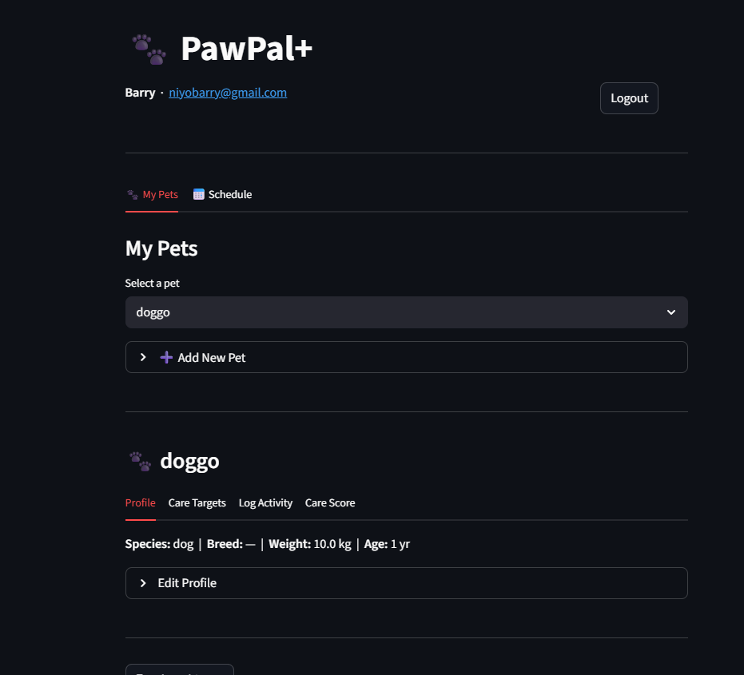

# PawPal+

> A smart pet care scheduling app built with Python and Streamlit.

PawPal+ helps pet owners stay consistent with daily care routines. It tracks tasks like feeding, walks, grooming, and vet visits — then applies scheduling algorithms to surface the most urgent work first, detect conflicts before they happen, and keep recurring goals in sync automatically.

---

## Screenshots

### Pet Dashboard


### Care Score & History


### System Design — UML Class Diagram


---

## Features

### Multi-Pet Owner Support
Register and log in securely (SHA-256 password hashing). Each account manages an unlimited number of pets, each with its own profile, care targets, activity log, and score history.

### Care Target Tracking
Set per-pet daily and interval-based targets across four care categories — meals per day, walk minutes per day, grooming interval (days), and vet visit interval (days). Targets start as `pending` and can be marked `achieved` when met.

### Care Target Auto-Reset
Targets can be configured with a `reset_period` of `daily` or `weekly`. Once achieved, `check_and_reset()` automatically flips the status back to `pending` when the qualifying time has elapsed — keeping recurring goals like daily feeding quotas in sync with the calendar without manual intervention.

### Activity Logging with Backdating
Log any care activity — feeding, walk, grooming, or vet visit — for any date (past or present). Walk entries capture duration in minutes. All logged activities feed directly into care score calculations.

### Care Score Calculation (A–D Grade)
`CareScoreService.calculate()` computes four independent percentages against the pet's targets for a given date:

| Metric | Algorithm |
|---|---|
| **Feeding** | `min(100, meals_logged / daily_meals × 100)` |
| **Exercise** | `min(100, walk_minutes_logged / daily_walk_min × 100)` |
| **Grooming** | `100` if most recent grooming is within `grooming_interval_days`, else `0` |
| **Vet** | `100` if most recent vet visit is within `vet_interval_days`, else `0` |

The overall score is the average of all four, graded A (≥90), B (≥80), C (≥70), or D (<70). Calling calculate twice for the same pet and date upserts in place — no duplicate records.

### Three Task Sorting Strategies
Tasks can be sorted by any of three pure functions, each returning a new sorted list:

| Strategy | Behaviour |
|---|---|
| **Urgency** | Overdue tasks surface first, then ascending by scheduled date |
| **Care Score** | Pets with the lowest overall care score are prioritised |
| **Completion Gap** | Pets furthest from meeting today's targets appear first |

All three strategies are stateless pure functions — they accept any task list and are independently composable with status and pet filters.

### Recurring Task Automation
Marking a task `done` or `skipped` automatically spawns the next occurrence at the correct future date. Three recurrence modes are supported:

- `daily` — next occurrence in 1 day
- `weekly` — next occurrence in 7 days
- `custom` — next occurrence in a user-defined number of days

Each spawned task is linked back to its origin via `parent_task_id`, creating a full recurrence chain without requiring manual re-entry.

### Conflict Detection (4 Rules)
`TaskService.detect_conflicts()` scans a configurable day window (default 7 days) and returns structured `ConflictReport` objects — never raises exceptions — for four conflict patterns:

| Rule | Conflict Type | Condition |
|---|---|---|
| A | `duplicate_non_feeding` | Same non-feeding task type, same pet, same day |
| B | `time_proximity` | Two timed tasks fewer than 30 minutes apart, same pet, same day |
| C | `daily_overload` | More than 6 pending tasks for one pet on the same day |
| D | `cross_pet_time_clash` | Tasks for different pets booked at the exact same time |

Each report includes a plain-English message, the conflict type, and both task IDs so the UI can link directly to the offending tasks.

### Status and Pet Filtering
`TaskService.get_all_for_pets()` accepts an optional status filter (`pending`, `done`, `skipped`) and an arbitrary list of pet IDs. The Schedule view combines this with a name-search input and the three sort strategies to let owners slice their task list in any combination without loading unnecessary data.

---

## Project Structure

```
pawpal_system.py   — All data models, services, and sorting algorithms
app.py             — Streamlit UI
tests/
  test_pawpal.py   — 35-test pytest suite
reflection.md      — Design decisions, UML diagram, and AI collaboration notes
```

---

## Getting Started

### Requirements

- Python 3.10+
- pip

### Setup

```bash
python -m venv .venv
source .venv/bin/activate  # Windows: .venv\Scripts\activate
pip install -r requirements.txt
```

### Run the app

```bash
streamlit run app.py
```

---

## Testing

```bash
python -m pytest tests/test_pawpal.py -v
```

**35 tests across 5 areas:**

| Area | What is verified |
|---|---|
| **Sorting** | Chronological order, overdue-first, care score priority, completion gap priority |
| **Recurrence** | Daily / weekly / custom spawning on correct date; skip also spawns; one-off tasks return `None` |
| **Conflict detection** | All 4 rules fire correctly; boundary cases (exactly 30 min apart, exactly 6 tasks) do not false-positive |
| **Care score** | Percentages and grades correct; scores cap at 100%; overdue grooming scores 0; upsert updates in place |
| **Target reset** | Daily resets after 1 day, weekly after 7; pending targets and same-day achieved targets are never touched |

**Confidence level: 4 / 5** — All 35 tests pass including boundary conditions. One star withheld because in-memory storage means persistence bugs (concurrent writes, data across restarts) require integration tests against a real database to catch.

---

## Design

The full UML class diagram and a record of every design decision — including what changed from the initial plan and why — is in [reflection.md](reflection.md).
