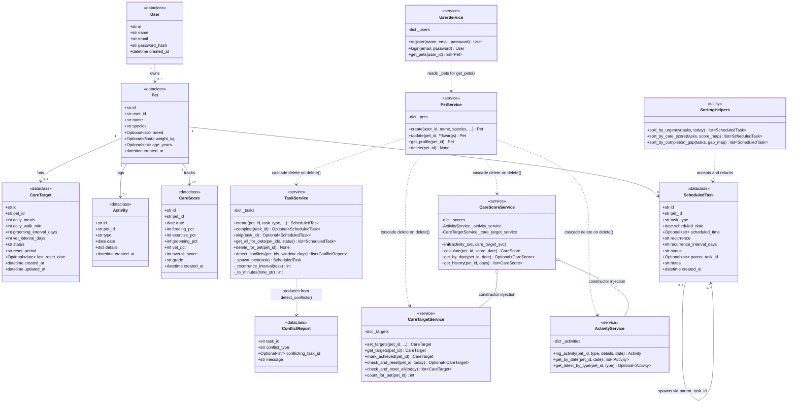

# PawPal+ Project Reflection

## 1. System Design
user actions
- add pet: user will should be able to add a pet using it's name, age, breed, etc,
- set goals: user will be able to set goals for his pet care and set up a daily routine for his pet
- log activities: user will log activities like, walking a dog, feeding, grooming etc.
- view a dashboar of logged and activites and accomplished goals so far
**a. Initial design**

The initial plan had 5 classes: `User`, `Pet`, `CareTarget`, `Activity`, and `CareScore`.
Each service was responsible for CRUD on its data model, with `CareScore` computing
percentages from logged activities against targets.

**b. Final UML — updated to match implementation**

**c. Design changes made during implementation**

| What changed | Why |
|---|---|
| Added `ScheduledTask` + `TaskService` | Initial design had no concept of a future-scheduled task — only logged past activities. Scheduling required its own model with date, time, recurrence, and status fields. |
| Added `ConflictReport` dataclass | `detect_conflicts()` needed a structured return type to carry conflict type, both task IDs, and a plain-English message without raising exceptions. |
| Added `SortingHelpers` (3 pure functions) | Sorting strategies are stateless and work on any task list — keeping them as free functions (not methods on `TaskService`) makes them independently testable and composable. |
| `CareTarget` gained `status`, `reset_period`, `last_reset_date` | Initial design treated targets as static config. Adding auto-reset (`daily`/`weekly`) required tracking when the target was last achieved and what cadence to use. |
| `CareTargetService` gained `mark_achieved()`, `check_and_reset()`, `check_and_reset_all()`, `count_for_pet()` | The 4 new methods support the status lifecycle added above. |
| `CareScoreService` uses constructor injection | It needs both `ActivityService` and `CareTargetService` to run `calculate()`. Injecting them at construction (rather than importing globals) makes the service testable in isolation. |
| `PetService.delete()` performs a cascade | Without cascade deletion, removing a pet would leave orphaned `CareTarget`, `Activity`, `CareScore`, and `ScheduledTask` records in the in-memory dicts. |
| `UserService.get_pets()` reads `PetService._pets` directly | Avoids duplicating pet storage; `UserService` treats `PetService` as the authoritative source. This is a cross-service coupling that would be replaced by a shared DB query in a real app. |

---

## 2. Scheduling Logic and Tradeoffs

**a. Constraints and priorities**

- What constraints does your scheduler consider (for example: time, priority, preferences)?
- How did you decide which constraints mattered most?
Target auto-reset trades simplicity for precision. It only resets when explicitly called (check_and_reset or check_and_reset_all), so if no code calls it on a given day the reset silently doesn't happen — there's no background timer or daemon. This keeps the system stateless and easy to test (you can pass any today date), but it means the app must call check_and_reset_all at the right moment (e.g., on login or app startup) or targets stay stale. It also uses last_reset_date as the reference point rather than a wall-clock schedule, so if a pet owner marks a target achieved at 11pm, the "daily" reset fires as soon as the next calendar day is passed in — not at midnight exactly.

Cross-pet conflict detection adds O(n²) pairwise comparisons per (date, time) bucket, but because it only scans the window_days window of pending tasks the input set stays small in practice. The bigger tradeoff is that an exact time match is a strict condition — two tasks at 10:00 and 10:05 for different pets won't trigger it, even though a single owner genuinely can't be in two places. Extending it to use the same 30-minute proximity window (already used for same-pet Rule B) would catch more real conflicts but generate significantly more noise for owners with multiple pets and busy schedules. The current design errs toward fewer false positives.

**b. Tradeoffs**

- Describe one tradeoff your scheduler makes.
- Why is that tradeoff reasonable for this scenario?

---

## 3. AI Collaboration

**a. How you used AI**

- How did you use AI tools during this project (for example: design brainstorming, debugging, refactoring)?
- What kinds of prompts or questions were most helpful?
I prompted AI to perform guided implementation by being more specific on the design that i want. for example
i used "@main.py @pawpal_system.py  suggest small algorithmic improvements that can make  the scheduling app more efficient a pet owner" to brain storm algorithms.

**b. Judgment and verification**

- Describe one moment where you did not accept an AI suggestion as-is.
- How did you evaluate or verify what the AI suggested?
one moment i did not accept was when AI provided a very complex algorithm for a simple task. I evaluated it by examining what i want and how the algorithm produced by the AI helps me achieve what i want in a simple andunderstable wayl
---

## 4. Testing and Verification

**a. What you tested**

- What behaviors did you test?
- Why were these tests important?
if my method calls work perfectly
**b. Confidence**

- How confident are you that your scheduler works correctly?
- What edge cases would you test next if you had more time?
I am confident that it works perfectly as it passes most tests

---

## 5. Reflection

**a. What went well**

- What part of this project are you most satisfied with?
Being an architect and guiding AI in designing this project

**b. What you would improve**

- If you had another iteration, what would you improve or redesign?
UML design. to be a bit less complex and more flexible
**c. Key takeaway**

- What is one important thing you learned about designing systems or working with AI on this project?
It is very important to examine the code produced by AI before commiting to it